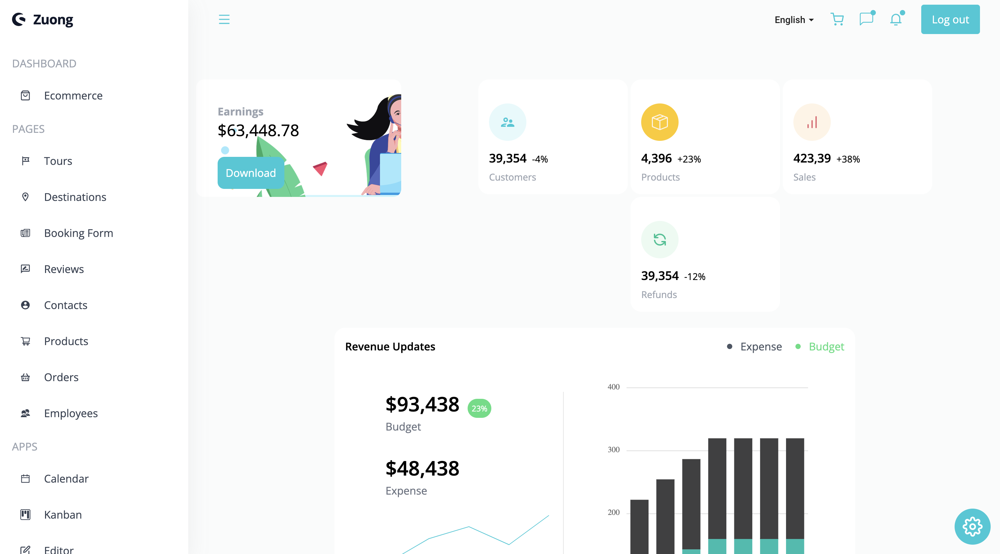

# Dashboard App

<a name="readme-top"></a>
[![Contributors][contributors-shield]][contributors-url]
[![Forks][forks-shield]][forks-url]
[![Stargazers][stars-shield]][stars-url]
[![Issues][issues-shield]][issues-url]
[![LinkedIn][linkedin-shield]][linkedin-url]

<!-- PROJECT LOGO -->
<br />
<div align="center">
  <a href="https://github.com/muoi07052001/dashboard-frontend">
  </a>

<h3 align="center">Dashboard App Front End</h3>

  <p align="center">
    <br />
    <a href="https://github.com/muoi07052001/dashboard-frontend"><strong>Explore the docs »</strong></a>
    <br />
    <br />
    <a href="https://github.com/muoi07052001/dashboard-frontend">View Repo</a>
    ·
    <a href="https://github.com/muoi07052001/dashboard-frontend/issues">Report Bug</a>
    ·
    <a href="https://github.com/muoi07052001/dashboard-frontend/issues">Request Feature</a>
  </p>
</div>

<!-- TABLE OF CONTENTS -->
<details>
  <summary>Table of Contents</summary>
  <ol>
    <li>
      <a href="#about-the-project">About The Project</a>
      <ul>
        <li><a href="#built-with">Built With</a></li>
      </ul>
    </li>
    <li>
      <a href="#getting-started">Getting Started</a>
      <ul>
        <li><a href="#prerequisites">Prerequisites</a></li>
        <li><a href="#installation">Installation</a></li>
      </ul>
    </li>
    <li><a href="#usage">Usage</a></li>
    <li><a href="#roadmap">Roadmap</a></li>
    <li><a href="#contributing">Contributing</a></li>
    <li><a href="#contact">Contact</a></li>
    <li><a href="#acknowledgments">Acknowledgments</a></li>
  </ol>
</details>

<!-- ABOUT THE PROJECT -->

## About The Project

<p>Live domain: <strong>https://dashboard-app-ten-topaz.vercel.app</strong></p>



<p align="right">(<a href="#readme-top">Back to top</a>)</p>

### Built With

- [![React][react.js]][react-url]
- [![Node][nest.js]][nest-url]
- [![Tailwind][tailwind]][tailwind-url]
- [![Vercel][vercel]][vercel-url]

<p align="right">(<a href="#readme-top">Back to top</a>)</p>

<!-- GETTING STARTED -->

## Getting Started

To get a local copy up and running follow these simple example steps.

### Prerequisites

Things you need to use the software and how to install them.

- npm
  ```sh
  npm install npm@latest -g
  ```
- yarn
  ```sh
  npm install --global yarn
  ```

### Installation

1. Get a API Domain, maybe using [AWS](https://vercel.amazon.com/)
2. Clone the repo
   ```sh
   git clone https://github.com/muoi07052001/dashboard-frontend.git
   ```
3. Install packages and dependencies (yarn)
   ```sh
   yarn install
   ```
4. Create a `.env.local` file, enter your API in `.env.local`
   ```js
   REACT_APP_API_DOMAIN = 'ENTER YOUR API';
   REACT_APP_API_LOCAL_DOMAIN = 'http://localhost:<PORT>';
   ```

<p align="right">(<a href="#readme-top">Back to top</a>)</p>

<!-- USAGE EXAMPLES -->

## Usage

How this project can be used. Additional screenshots, code examples and demos. You may also link to more resources.

_For more examples, please refer to the [Documentation](https://booking.com)_

This project was bootstrapped with [Create React App](https://github.com/facebook/create-react-app).

## Available Scripts

In the project directory, you can run:

### `yarn start`

Runs the app in the development mode.\
Open [http://localhost:3000](http://localhost:3000) to view it in your browser.

The page will reload when you make changes.\
You may also see any lint errors in the console.

### `yarn build`

Builds the app for production to the `build` folder.\
It correctly bundles React in production mode and optimizes the build for the best performance.

The build is minified and the filenames include the hashes.\
Your app is ready to be deployed!

See the section about [deployment](https://facebook.github.io/create-react-app/docs/deployment) for more information.

<p align="right">(<a href="#readme-top">Back to top</a>)</p>

<!-- ROADMAP -->

## Roadmap

- [x] Authentication / Users
- [x] CRUD Feature
  - [x] CRUD Tour
  - [x] CRUD Destination
  - [x] CRUD Booking Form
  - [x] CRUD Reviews
- [x] Shoppint Cart Feature
- [ ] Blog Feature

See the [open issues](https://github.com/muoi07052001/dashboard-frontend/issues) for a full list of proposed features (and known issues).

<p align="right">(<a href="#readme-top">Back to top</a>)</p>

<!-- CONTRIBUTING -->

## Contributing

Contributions are what make the open source community such an amazing place to learn, inspire, and create. Any contributions you make are **greatly appreciated**.

If you have a suggestion that would make this better, please fork the repo and create a pull request. You can also simply open an issue with the tag "enhancement".
Don't forget to give the project a star! Thanks again!

1. Fork the Project
2. Create your Feature Branch (`git checkout -b feature/AmazingFeature`)
3. Commit your Changes (`git commit -m 'Add some AmazingFeature'`)
4. Push to the Branch (`git push origin feature/AmazingFeature`)
5. Open a Pull Request

<p align="right">(<a href="#readme-top">Back to top</a>)</p>

<!-- CONTACT -->

## Contact

Nguyen Hai Duong - [@facebook_handle](https://www.facebook.com/duong.nguyenhai.7140/) - muoi07052001@gmail.com

Project Link: [https://github.com/muoi07052001/dashboard-frontend](https://github.com/muoi07052001/dashboard-frontend)

<p align="right">(<a href="#readme-top">Back to top</a>)</p>

<!-- ACKNOWLEDGMENTS -->

## [WIP] Acknowledgments

- []()
- []()
- []()

<p align="right">(<a href="#readme-top">Back to top</a>)</p>

<!-- MARKDOWN LINKS & IMAGES -->
<!-- https://www.markdownguide.org/basic-syntax/#reference-style-links -->

[contributors-shield]: https://img.shields.io/github/contributors/muoi07052001/dashboard-frontend.svg?style=for-the-badge
[contributors-url]: https://github.com/muoi07052001/dashboard-frontend/graphs/contributors
[forks-shield]: https://img.shields.io/github/forks/muoi07052001/dashboard-frontend.svg?style=for-the-badge
[forks-url]: https://github.com/muoi07052001/dashboard-frontend/network/members
[stars-shield]: https://img.shields.io/github/stars/muoi07052001/dashboard-frontend.svg?style=for-the-badge
[stars-url]: https://github.com/muoi07052001/dashboard-frontend/stargazers
[issues-shield]: https://img.shields.io/github/issues/muoi07052001/dashboard-frontend.svg?style=for-the-badge
[issues-url]: https://github.com/muoi07052001/dashboard-frontend/issues
[license-shield]: https://img.shields.io/github/license/muoi07052001/dashboard-frontend.svg?style=for-the-badge
[license-url]: https://github.com/muoi07052001/dashboard-frontend/blob/master/LICENSE.txt
[linkedin-shield]: https://img.shields.io/badge/-LinkedIn-black.svg?style=for-the-badge&logo=linkedin&colorB=555
[linkedin-url]: https://www.linkedin.com/in/nguyen-duong-072879247/
[product-screenshot]: images/product-screenshot.png
[react.js]: https://img.shields.io/badge/React-20232A?style=for-the-badge&logo=react&logoColor=61DAFB
[react-url]: https://reactjs.org/
[nest.js]: https://img.shields.io/badge/Nest.js-e0234d?style=for-the-badge&logo=nestjs&logoColor=white
[nest-url]: https://nestjs.com/
[express.js]: https://img.shields.io/badge/Express.js-000000?style=for-the-badge&logo=express&logoColor=white
[express-url]: https://expressjs.com/
[tailwind]: https://img.shields.io/badge/Tailwind-38bdf9?style=for-the-badge&logo=tailwindcss&logoColor=white
[tailwind-url]: https://tailwindcss.com/
[vercel]: https://img.shields.io/badge/vercel-000000?style=for-the-badge&logo=vercel&logoColor=white
[vercel-url]: https://vercel.com/
